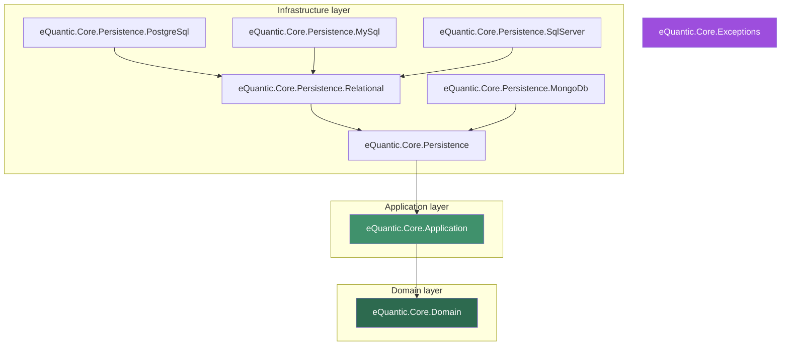

# eQuantic Core DDD

**A small, focused set of .NET building blocks for applications built with Domain-Driven Design (DDD) and Clean Architecture.**

These packages were extracted from [`eQuantic/core-api`](https://github.com/eQuantic/core-api) into their own repository so that the DDD / Clean-Architecture layers can evolve and be versioned on their own. They give you the *conventions and tactical building blocks* — aggregate roots and value objects, entity contracts, request/response models, layered exceptions, EF Core model conventions, and a **domain-persistence seam** that maps pure-domain aggregates to storage and dispatches their domain events through an outbox — so your own domain stays pure and your infrastructure stays thin.

| | |
|---|---|
| **Target frameworks** | `net8.0`, `net10.0` (plus `netstandard2.1` for `eQuantic.Core.Exceptions`) |
| **Language** | C# (`latest`, nullable + implicit usings enabled) |
| **License** | [MIT](LICENSE) |
| **Versioning** | [Semantic Versioning](https://semver.org) via `semantic-release` (see [Versioning & releases](#versioning--releases)) |

---

## Table of contents

1. [Why these packages?](#why-these-packages)
2. [The packages at a glance](#the-packages-at-a-glance)
3. [How the layers fit together](#how-the-layers-fit-together)
4. [Installation](#installation)
5. [Package deep-dive](#package-deep-dive)
   - [eQuantic.Core.Domain](#equanticcoredomain)
   - [eQuantic.Core.Application](#equanticcoreapplication)
   - [eQuantic.Core.Exceptions](#equanticcoreexceptions)
   - [eQuantic.Core.Persistence](#equanticcorepersistence)
   - [eQuantic.Core.Persistence.Relational](#equanticcorepersistencerelational)
   - [Provider packages: PostgreSQL, MySQL, SQL Server, MongoDB](#provider-packages)
6. [The domain-persistence seam](#the-domain-persistence-seam)
7. [End-to-end walkthrough](#end-to-end-walkthrough)
8. [Versioning & releases](#versioning--releases)
9. [Contributing](#contributing)
10. [License](#license)

---

## Why these packages?

Clean Architecture asks you to keep a strict **dependency direction**: your domain knows nothing about the outside world, your application orchestrates the domain, and infrastructure (databases, HTTP) depends *inward* — never the reverse.

```
Infrastructure  ─────►  Application  ─────►  Domain
 (EF Core, HTTP)         (use cases)         (aggregates, rules)
```

In practice, every service re-implements the same plumbing: an aggregate root that raises domain events, value objects with value equality, a paged-list request that reads `pageIndex`/`filterBy`/`orderBy` from the query string, a set of exceptions that map cleanly to HTTP status codes, and — the hard part — a way to persist a **pure-domain** aggregate without leaking storage concerns into it, while making sure its domain events are never lost.

**eQuantic Core DDD packages that plumbing once, so you don't.** Each package targets one layer, and you only take the ones you need — the domain package has no database dependency, the persistence packages have no HTTP dependency, and the [domain-persistence seam](#the-domain-persistence-seam) keeps your aggregates free of any `IEntity`/DataModel concern.

---

## The packages at a glance

| Package | What it gives you | Key dependencies |
|---|---|---|
| [`eQuantic.Core.Domain`](https://www.nuget.org/packages/eQuantic.Core.Domain) | `AggregateRoot`, `EntityBase`, `ValueObject`, entity contracts, request/result models, query-string filtering & sorting | `eQuantic.Core`, `eQuantic.Linq.Web`, `eQuantic.Core.DomainEvents` |
| [`eQuantic.Core.Application`](https://www.nuget.org/packages/eQuantic.Core.Application) | `IApplicationContext`, an injectable clock, and the request → `QueryOptions` bridge | `eQuantic.Core.Domain`, `eQuantic.Core.Data`, `eQuantic.Mapper`, `eQuantic.Core.CQS.Abstractions` |
| [`eQuantic.Core.Exceptions`](https://www.nuget.org/packages/eQuantic.Core.Exceptions) | A vocabulary of domain exceptions that map to HTTP semantics | — (stand-alone) |
| [`eQuantic.Core.Persistence`](https://www.nuget.org/packages/eQuantic.Core.Persistence) | The **domain-persistence seam** (aggregate repository, tracker, outbox unit of work) + EF Core auditing conventions | `eQuantic.Core.Application`, `eQuantic.Core.DataModel` |
| [`eQuantic.Core.Persistence.Relational`](https://www.nuget.org/packages/eQuantic.Core.Persistence.Relational) | Table naming (pluralize + case), fully-qualified PKs, user-audit foreign keys | `eQuantic.Core.Persistence` |
| [`eQuantic.Core.Persistence.PostgreSql`](https://www.nuget.org/packages/eQuantic.Core.Persistence.PostgreSql) | PostgreSQL defaults (snake_case, UTC `CreatedAt` default) | `…Persistence.Relational` |
| [`eQuantic.Core.Persistence.MySql`](https://www.nuget.org/packages/eQuantic.Core.Persistence.MySql) | MySQL defaults (snake_case, UTC `CreatedAt` default) | `…Persistence.Relational` |
| [`eQuantic.Core.Persistence.SqlServer`](https://www.nuget.org/packages/eQuantic.Core.Persistence.SqlServer) | SQL Server defaults (PascalCase, UTC `CreatedAt` default) | `…Persistence.Relational` |
| [`eQuantic.Core.Persistence.MongoDb`](https://www.nuget.org/packages/eQuantic.Core.Persistence.MongoDb) | MongoDB collection/element naming conventions | `…Persistence` |

> **Two companion packages** complete the picture: **`eQuantic.Core.DomainEvents`** provides the event-raising `AggregateRoot` base, and **`eQuantic.Core.DataModel`** (which lives in [`eQuantic/core-data`](https://github.com/eQuantic/core-data)) owns the `IEntity`/`EntityDataBase` storage contracts and the user-audit interfaces (`IEntityOwned`, `IEntityTrack`, `IEntityHistory`). Your **aggregates** come from `eQuantic.Core.Domain`; your **DataModels** implement `IEntity` from `eQuantic.Core.DataModel`; the seam maps between them.

---

## How the layers fit together



The arrows are **project references** — and they only ever point *inward* (toward the domain), which is exactly what Clean Architecture requires. `eQuantic.Core.Exceptions` is deliberately stand-alone so any layer can throw its exceptions without dragging in a dependency.

**Domain vs. DataModel.** The defining idea of the 5.x line is that an aggregate is *never* a database row. Your aggregate is a pure-domain object; a separate **DataModel** is what actually gets stored. The seam maps between them and turns domain events into durable outbox messages:

```
Domain aggregate ──map (eQuantic.Mapper)──► DataModel ──► database  ┐
      │                                                             │ one transaction
      └── domain events ──────────────────► outbox rows ───────────┘ ──► relay ──► handlers
```

---

## Installation

Take only what your layer needs. A typical web API that persists aggregates to PostgreSQL uses:

```bash
dotnet add package eQuantic.Core.Domain
dotnet add package eQuantic.Core.Exceptions
dotnet add package eQuantic.Core.Persistence.PostgreSql
```

Because the persistence packages reference each other transitively, adding `eQuantic.Core.Persistence.PostgreSql` also brings in `…Relational`, `…Persistence`, `…Application` and `…Domain`. Swap the last line for `…MySql`, `…SqlServer` or `…MongoDb` to target a different store.

---

## Package deep-dive

### eQuantic.Core.Domain

The heart of the domain layer: the tactical DDD building blocks your model is made of. It references `Microsoft.AspNetCore.App` so the request types can carry MVC/Minimal-API binding attributes, but it has **no database dependency**.

#### Entities — identity equality

`IDomainEntity<TKey>` is the minimal contract (an entity that can surface and set its key). `EntityBase<TKey>` implements it and adds the DDD **identity equality** rule: two entities are equal when they are the same type and share the same non-default `Id`. An entity whose key is still the default value is *transient* and compares only by reference. `EntityBase` is the `int`-keyed shortcut; `EntityDescriptionBase<TKey>` adds a nullable `Description`.

```csharp
using eQuantic.Core.Domain.Entities;

public sealed class Customer : EntityBase<Guid>;

var id = Guid.NewGuid();
new Customer { Id = id } == new Customer { Id = id };   // true  — same identity
new Customer() == new Customer();                       // false — both transient
```

#### Aggregate roots — identity + domain events

`AggregateRoot<TKey>` is the consistency boundary of an aggregate and the source of its domain events. It builds on `eQuantic.Core.DomainEvents.AggregateRoot<TKey>`, so it can `RaiseDomainEvent(...)` and expose the uncommitted ones — and it is **pure domain**: it implements `IDomainEntity<TKey>` and knows nothing about persistence (it is never an `IEntity`/DataModel). `AggregateRoot` (no type argument) is the common `Guid`-keyed case. `Id` has a **protected** setter, so identity is assigned from inside the aggregate.

```csharp
using eQuantic.Core.Domain.Entities;
using eQuantic.Core.DomainEvents;

public sealed class OrderPlaced(Guid orderId) : DomainEventBase
{
    public Guid OrderId { get; } = orderId;
}

public sealed class Order : AggregateRoot          // Guid key
{
    public string Customer { get; private set; } = "";

    private Order(Guid id, string customer)
    {
        Id = id;                                   // protected setter — from inside the aggregate
        Customer = customer;
        RaiseDomainEvent(new OrderPlaced(id));
    }

    public static Order Place(Guid id, string customer) => new(id, customer);
}

var order = Order.Place(Guid.NewGuid(), "acme");
order.GetUncommittedEvents();   // [ OrderPlaced ]  — drained into the outbox on commit (see the seam)
```

#### Value objects — value equality

`ValueObject` (namespace `eQuantic.Core.Domain.ValueObjects`) is the base for concepts with **no identity**, compared by the value of their components. Return the defining members from `GetEqualityComponents()` and structural equality, hash code and the `==`/`!=` operators come for free. Value objects are meant to be immutable — expose read-only members and construct a new instance to represent a change.

```csharp
using eQuantic.Core.Domain.ValueObjects;

public sealed class Money(decimal amount, string currency) : ValueObject
{
    public decimal Amount { get; } = amount;
    public string Currency { get; } = currency;

    protected override IEnumerable<object?> GetEqualityComponents()
    {
        yield return Amount;
        yield return Currency;
    }
}

new Money(10m, "USD") == new Money(10m, "USD");   // true  — same value
new Money(10m, "USD") == new Money(10m, "EUR");   // false — a component differs
```

#### Request contracts

A family of request DTOs models the shapes an HTTP API repeatedly needs, pre-decorated with binding attributes (`[FromRoute]`, `[FromQuery]`, `[FromBody]`) so they bind directly in controllers and Minimal APIs.

| Request | Binds | Use for |
|---|---|---|
| `ItemRequest<TKey>` | `Id` from route | "operate on one item by id" |
| `GetRequest<TKey>` | `Id` + `IncludeFields` (query) | reads with optional field expansion |
| `CreateRequest<TBody>` | `Body` from body | create |
| `UpdateRequest<TBody, TKey>` | `Id` (route) + `Body` (body) | update |
| `PagedListRequest<TEntity>` | `pageIndex`, `pageSize`, `filterBy`, `orderBy`, `includeFields` | list endpoints |

Each has a **referenced** variant (`…<…, TReferenceKey>`) implementing `IReferencedRequest<TReferenceKey>`, for nested/sub-resource routes such as `/categories/{categoryId}/products/{id}` — it carries the parent (`categoryId`) key alongside the item key.

#### Query-string filtering & sorting

`PagedListRequest<TEntity>` exposes `FilterBy` and `OrderBy` as typed, bindable collections powered by the [eQuantic.Linq](https://www.nuget.org/packages/eQuantic.Linq) v3 syntax. Clients express filters and ordering in the URL and you get back a compiled predicate and typed sorts:

```
GET /v1/products?pageIndex=1&pageSize=20&filterBy=total:gt(100),name:ct(pro)&orderBy=total:desc,name
```

- `filterBy=total:gt(100),name:ct(pro)` → `total > 100 AND name contains "pro"`
- `orderBy=total:desc,name` → order by `total` descending, then `name` ascending

```csharp
var predicate = request.GetFilterPredicate();          // Expression<Func<T, bool>>? (null when no filter)
IReadOnlyList<QuerySort<T>> sorts = request.GetSorts(); // typed sorts (empty when none)
```

`FilteringCollection<TEntity>` and `SortingCollection<TEntity>` also expose static `TryParse` (for MVC attribute binding) and `BindAsync` (for direct Minimal-API parameters), so they bind natively either way. `PagedListResult<T>` is the counterpart response — items plus paging metadata (`PageIndex`, `PageSize`, `TotalCount`).

---

### eQuantic.Core.Application

Conventions for the application (use-case) layer.

- **`IApplicationContext`** / **`IApplicationContext<TUserKey>`** — an abstraction over "the current runtime": app `Version`, `LocalPath`, `LastUpdate`, plus the current user (`GetCurrentUserIdAsync`, `GetCurrentUserRolesAsync`, `CurrentUserIsInRoleAsync`). Implement it once against your auth stack; your use cases depend on the interface, not on `HttpContext`. The persistence layer reads it to stamp *who* created/updated/deleted a record (see [`UseApplicationAudit`](#the-domain-persistence-seam)).

- **`IDateTimeProviderService`** + **`DateTimeProviderService`** — an **injectable clock** (`GetUtcNow`, `GetLocalNow`, `GetTimestamp`). On `net8.0` it wraps the framework `TimeProvider`; elsewhere it falls back to `DateTimeOffset`. Register it with `services.AddDateTimeProviderService()`. Injecting the clock instead of calling `DateTime.UtcNow` directly makes time deterministic in tests.

- **`PagedListRequestExtensions`** (namespace `eQuantic.Core.Application.Querying`) — bridges the HTTP request model to the native query engine. Because both `PagedListRequest` and `eQuantic.Core.Data` are built on eQuantic.Linq, the filter compiles to the same predicate and the sorts pass straight through:

  ```csharp
  using eQuantic.Core.Application.Querying;

  QueryOptions<ProductData> options = request.ToQueryOptions();  // filter + sort + includes
  PageRequest page = request.ToPageRequest();                    // pageIndex / pageSize (with defaults)
  var result = await readRepository.GetPagedAsync(options, page);
  ```

- **`IApplicationService`** — a marker interface for application services (useful for assembly-scanning registrations).

---

### eQuantic.Core.Exceptions

A vocabulary of exceptions that carry *domain meaning*, so the edge of your app can translate them into HTTP responses in one place. All are `[Serializable]` and message-localized via resources. This package is stand-alone (`netstandard2.1;net8.0;net10.0`).

| Exception | Meaning | Natural HTTP status |
|---|---|---|
| `EntityNotFoundException` / `EntityNotFoundException<TKey>` | The requested entity does not exist (carries the `Id`) | `404 Not Found` |
| `NoDataFoundException` | A query returned no data for an entity type | `404 Not Found` |
| `InvalidEntityReferenceException<TReferenceKey>` | A referenced parent/related entity is invalid | `400 Bad Request` |
| `InvalidEntityRequestException` | Request validation failed (carries an `Errors` dictionary) | `422 Unprocessable Entity` |
| `ForbiddenAccessException` | The caller may not perform the action | `403 Forbidden` |
| `DependencyNotFoundException` | A required dependency/service was not resolved (carries the `Type`) | `500 Internal Server Error` |

Map them to responses once, e.g. with the ASP.NET Core exception handler:

```csharp
using eQuantic.Core.Exceptions;
using Microsoft.AspNetCore.Diagnostics;

app.UseExceptionHandler(handler => handler.Run(async context =>
{
    var ex = context.Features.Get<IExceptionHandlerFeature>()?.Error;

    var (status, title) = ex switch
    {
        EntityNotFoundException             => (StatusCodes.Status404NotFound,           "Entity not found"),
        NoDataFoundException                => (StatusCodes.Status404NotFound,           "No data found"),
        InvalidEntityReferenceException     => (StatusCodes.Status400BadRequest,         "Invalid reference"),
        InvalidEntityRequestException       => (StatusCodes.Status422UnprocessableEntity,"Validation failed"),
        ForbiddenAccessException            => (StatusCodes.Status403Forbidden,          "Forbidden"),
        DependencyNotFoundException         => (StatusCodes.Status500InternalServerError,"Dependency not found"),
        _                                   => (StatusCodes.Status500InternalServerError,"Unexpected error"),
    };

    context.Response.StatusCode = status;
    await context.Response.WriteAsJsonAsync(new { status, title, detail = ex?.Message });
}));
```

```csharp
// Throwing from a use case then reads naturally:
var order = await orders.GetAsync(id) ?? throw new EntityNotFoundException<Guid>(id);
```

---

### eQuantic.Core.Persistence

This package has two responsibilities. The first — the [domain-persistence seam](#the-domain-persistence-seam) — is the flagship and has its own section below. The second is a set of provider-agnostic **Entity Framework Core conventions** for shaping the tables your **DataModels** map to.

Call the convention from `OnModelCreating` and, when auditing is enabled, it configures the audit columns of every entity type based on the interfaces it implements:

```csharp
using eQuantic.Core.Persistence.Extensions;

protected override void OnModelCreating(ModelBuilder modelBuilder)
{
    base.OnModelCreating(modelBuilder);
    modelBuilder.ApplyDataModelConventions(o => o.EnableEntityAuditing());
}
```

| Implements | Column configured | Nullability |
|---|---|---|
| `IEntityTimeMark` (Domain) | `CreatedAt` | required |
| `IEntityTimeTrack` (Domain) | `UpdatedAt` | nullable |
| `IEntityTimeEnded` (Domain) | `DeletedAt` | nullable |
| `IEntityOwned<…>` (DataModel) | `CreatedById` | required |
| `IEntityTrack<…>` (DataModel) | `UpdatedById` | nullable |
| `IEntityHistory<…>` (DataModel) | `DeletedById` | nullable |

It also ships **`HasJsonData`**, a helper to seed a table from an embedded JSON resource:

```csharp
modelBuilder.Entity<Country>()
    .HasJsonData<Country>("SeedData.countries.json", typeof(MyDbContext).Assembly);
```

---

### eQuantic.Core.Persistence.Relational

Everything in the base package, **plus relational naming conventions**. Call `ApplyRelationalDataModelConventions` and each entity gets a consistent table name and (optionally) fully-qualified primary-key columns and audit foreign keys:

```csharp
using eQuantic.Core.Persistence.Relational.Extensions;

modelBuilder.ApplyRelationalDataModelConventions(o => o
    .UseSnakeCase()                            // table & column casing
    .UseFullyQualifiedPrimaryKeys()            // Product.Id → product_id
    .RemoveEntitySuffixFromTableName("Data")   // ProductData → "products"
    .EnableEntityAuditing());
```

What it does for every entity:

- **Table names** are pluralized (via Humanizer) and cased per `NamingCase` — `Product` → `products` (snake) / `Products` (pascal).
- **`RemoveEntitySuffixFromTableName("Data")`** strips a class-name suffix before pluralizing, so `ProductData` maps to `products`.
- **`UseFullyQualifiedPrimaryKeys()`** renames the `Id` column to `{entity}_id` (`product_id`), which many teams prefer for joins.
- **User-audit relationships** — for entities implementing `IEntityOwned<TUser, TUserKey>` / `IEntityTrack<…>` / `IEntityHistory<…>`, it wires the `CreatedBy` / `UpdatedBy` / `DeletedBy` navigations as foreign keys with `DeleteBehavior.NoAction`.

There's also `options.UseDataModelNamingConvention(NamingCase.SnakeCase)` on `DbContextOptionsBuilder` to switch on the matching [EFCore.NamingConventions](https://github.com/efcore/EFCore.NamingConventions) provider so EF's own generated columns are cased consistently too.

---

### Provider packages

Each provider package is a thin layer over the relational conventions that picks **sensible defaults for that database** and sets the right SQL default for `CreatedAt`. You call one method and get an idiomatic schema.

| Package | Default casing | Fully-qualified PKs | `CreatedAt` SQL default | Entry point |
|---|---|---|---|---|
| `…PostgreSql` | snake_case | on | `NOW() AT TIME ZONE 'UTC'` | `ApplyPostgreSqlDataModelConventions()` |
| `…MySql` | snake_case | on | `UTC_TIMESTAMP()` | `ApplyMySqlDataModelConventions()` |
| `…SqlServer` | PascalCase | on | `GETUTCDATE()` | `ApplySqlServerDataModelConventions()` |
| `…MongoDb` | (as configured) | n/a | n/a | `ApplyMongoDbDataModelConventions()` |

Every default is overridable through the options callback (the same fluent options as the relational layer). The **MongoDB** package is document-oriented: instead of table/PK naming it applies **collection** and **element** naming (`UseSnakeCase()` / `UseCamelCase()` / `UsePascalCase()`, `RemoveEntitySuffixFromCollectionName()`), still honouring the audit conventions.

---

## The domain-persistence seam

This is the piece that lets you keep aggregates **pure** and still persist them reliably. It lives in `eQuantic.Core.Persistence` and is built on the native `eQuantic.Core.Data` repository engine plus `eQuantic.Mapper`.

The three moving parts:

| Type | Role |
|---|---|
| `IAggregateRepository<TAggregate, TData, TKey>` | Loads/stages an **aggregate** by mapping it to/from its **DataModel** (via `eQuantic.Mapper`) and delegating to the native repository. On every write it records the aggregate with the tracker. |
| `IAggregateTracker` | Collects the aggregates mutated in the current unit of work, so their events can be drained on commit. Scoped (one per request). |
| `IDomainUnitOfWork` | On `CommitAsync()`, drains each tracked aggregate's uncommitted domain events, stages them as **outbox** messages, and commits the native unit of work — so the DataModels **and** the outbox rows land in **one transaction**. |

Why the outbox? Because it closes the gap between "saved the aggregate" and "published the event": a crash in between can never lose an event, on any store. Delivery is then the outbox relay's job.

**Register it** — pair `AddDomainPersistence()` with your mappers, the native provider's repositories for your DataModels, and the native outbox:

```csharp
services.AddDomainPersistence();   // IAggregateTracker, IAggregateRepository<,,>, IDomainUnitOfWork
services.AddMappers();             // eQuantic.Mapper — your Order <-> OrderData mappers
// + the native provider repositories for your DataModels, and IOutboxRepository
```

**Define the aggregate (pure domain) and its DataModel (persistence shape):**

```csharp
using eQuantic.Core.Domain.Entities;
using eQuantic.Core.DataModel;            // IEntity<TKey>

public sealed class Order : AggregateRoot            // pure domain — raises OrderPlaced
{
    public string Customer { get; private set; } = "";
    private Order(Guid id, string customer) { Id = id; Customer = customer; RaiseDomainEvent(new OrderPlaced(id)); }
    public static Order Place(Guid id, string customer) => new(id, customer);
}

public sealed class OrderData : IEntity<Guid>        // persistence shape — what actually gets stored
{
    public Guid Id { get; set; }
    public string Customer { get; set; } = "";
    public Guid GetKey() => Id;
    public void SetKey(Guid key) => Id = key;
}
```

**Use it in a command handler** — the aggregate never sees the database, and its event is guaranteed to ship:

```csharp
public async Task Handle(
    PlaceOrder command,
    IAggregateRepository<Order, OrderData, Guid> orders,
    IDomainUnitOfWork unitOfWork)
{
    var order = Order.Place(command.Id, command.Customer);

    await orders.AddAsync(order);      // maps Order → OrderData, tracks the aggregate
    await unitOfWork.CommitAsync();    // writes OrderData AND stages OrderPlaced in the outbox — atomically
}
```

**Stamp the auditing user.** The native engine already stamps `CreatedAt`/`UpdatedAt`/`DeletedAt` and honours soft delete by convention; `UseApplicationAudit()` fills in *who* by resolving the current user from `IApplicationContext`:

```csharp
using eQuantic.Core.Persistence.Extensions;

services.AddPostgreSqlDatabase(connectionString,
    model => { /* map your DataModels */ },
    conventions => conventions.UseApplicationAudit());   // CreatedById / UpdatedById / DeletedById
```

---

## End-to-end walkthrough

A PostgreSQL-backed order API, tying the layers together.

**1. Domain** — a pure aggregate that raises an event (`eQuantic.Core.Domain`), as shown [above](#the-domain-persistence-seam).

**2. Persistence** — the `OrderData` DataModel, its EF Core table shaped by conventions (`eQuantic.Core.Persistence.PostgreSql`):

```csharp
protected override void OnModelCreating(ModelBuilder modelBuilder)
{
    base.OnModelCreating(modelBuilder);
    modelBuilder.ApplyPostgreSqlDataModelConventions();
    // orders table: snake_case, order_id PK, created_at default = UTC now.
}
```

**3. Composition root** (`Program.cs`):

```csharp
builder.Services.AddDomainPersistence();
builder.Services.AddMappers();
builder.Services.AddDateTimeProviderService();
// + AddPostgreSqlDatabase(...), the OrderData repository, and the outbox
```

**4. A paged, filterable read endpoint** (`eQuantic.Core.Domain` requests + the `QueryOptions` bridge):

```csharp
// GET /v1/orders?pageIndex=1&pageSize=20&filterBy=customer:ct(acme)&orderBy=createdAt:desc
app.MapGet("/v1/orders", async ([AsParameters] PagedListRequest<OrderData> request, IOrderReadRepository reads) =>
{
    var page = await reads.GetPagedAsync(request.ToQueryOptions(), request.ToPageRequest());
    return Results.Ok(new PagedListResult<OrderData>(page));
});
```

**5. Domain errors → HTTP** (`eQuantic.Core.Exceptions`) — wire the exception handler shown [above](#equanticcoreexceptions), then `throw new EntityNotFoundException<Guid>(id)` anywhere and the edge turns it into a `404`.

---

## Versioning & releases

This repository follows [**Semantic Versioning**](https://semver.org) and publishes to NuGet automatically with [`semantic-release`](https://semantic-release.gitbook.io). You never bump a version by hand — the version is computed from commit messages on every push to `main`.

The packages were extracted from `core-api` at its `v4.0.0` release; the tactical DDD building blocks and the domain-persistence seam then shipped as the breaking **`v5.0.0`**, which is the current line.

| Commit type | Example | Resulting bump |
|---|---|---|
| `fix:` / `perf:` | `🐛 fix: correct paging offset` | patch (`5.0.0` → `5.0.1`) |
| `feat:` | `✨ feat: add slug filtering` | minor (`5.0.0` → `5.1.0`) |
| `feat!:` / `BREAKING CHANGE:` | `✨ feat!: rename aggregate contract` | major (`5.0.0` → `6.0.0`) |
| `docs:` / `chore:` / `refactor:` / `test:` / `ci:` | `📝 docs: expand README` | none (no release) |

When a release fires, the pipeline (`.github/workflows/release.yml`) runs the test matrix, then `semantic-release` computes the version, updates `CHANGELOG.md` + `src/Directory.Build.props`, packs all `src/**` projects, pushes the `.nupkg` + `.snupkg` symbols to NuGet.org, and creates the `v{version}` git tag and GitHub release.

Commits use the `emoji type: description` house style (the leading gitmoji is optional to the analyzer):

```
✨ feat: add the aggregate repository seam
🐛 fix: correct paging offset in list endpoint
📝 docs: document the domain-persistence seam
♻️ refactor: simplify request binding
✅ test: cover the outbox unit of work
🔧 chore: bump EF Core to 10.0.3
```

---

## Contributing

1. Branch off `main`.
2. Build and test both target frameworks:
   ```bash
   dotnet test eQuantic.Core.DDD.sln -c Release
   ```
3. Commit using the [conventional format](#versioning--releases) above — the commit type is what drives the released version.
4. Open a pull request against `main`. CI (`.github/workflows/ci.yml`) builds and tests on Linux and Windows and smoke-packs the packages.

---

## License

Released under the [MIT License](LICENSE). © eQuantic Tech.
