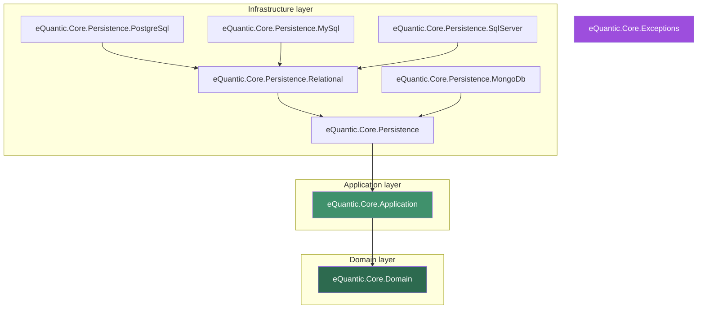

# eQuantic Core DDD

**A small, focused set of .NET building blocks for applications built with Domain-Driven Design (DDD) and Clean Architecture.**

These packages were extracted from [`eQuantic/core-api`](https://github.com/eQuantic/core-api) into their own repository so that the DDD / Clean-Architecture layers can evolve and be versioned on their own. They give you the *conventions* — base entities, request/response contracts, layered exceptions, and Entity Framework Core model conventions — so your own aggregates stay thin and consistent.

| | |
|---|---|
| **Target frameworks** | `net8.0`, `net10.0` (plus `netstandard2.1` for `eQuantic.Core.Exceptions`) |
| **Language** | C# (`latest`, nullable + implicit usings enabled) |
| **License** | [MIT](LICENSE) |
| **Versioning** | [Semantic Versioning](https://semver.org) via `semantic-release` (see [Versioning & releases](#versioning--releases)) |

---

## Table of contents

1. [Why these packages?](#why-these-packages)
2. [The packages at a glance](#the-packages-at-a-glance)
3. [How the layers fit together](#how-the-layers-fit-together)
4. [Installation](#installation)
5. [Package deep-dive](#package-deep-dive)
   - [eQuantic.Core.Domain](#equanticcoredomain)
   - [eQuantic.Core.Application](#equanticcoreapplication)
   - [eQuantic.Core.Exceptions](#equanticcoreexceptions)
   - [eQuantic.Core.Persistence](#equanticcorepersistence)
   - [eQuantic.Core.Persistence.Relational](#equanticcorepersistencerelational)
   - [Provider packages: PostgreSQL, MySQL, SQL Server, MongoDB](#provider-packages)
6. [End-to-end walkthrough](#end-to-end-walkthrough)
7. [Versioning & releases](#versioning--releases)
8. [Contributing](#contributing)
9. [License](#license)

---

## Why these packages?

Clean Architecture asks you to keep a strict **dependency direction**: your domain knows nothing about the outside world, your application orchestrates the domain, and infrastructure (databases, HTTP) depends *inward* — never the reverse.

```
Infrastructure  ─────►  Application  ─────►  Domain
 (EF Core, HTTP)         (use cases)         (entities, rules)
```

In practice, every service re-implements the same plumbing: an entity base class with an `Id`, a paged-list request that reads `pageIndex`/`filterBy`/`orderBy` from the query string, a set of exceptions that map cleanly to HTTP status codes, and a bag of EF Core conventions so tables are named consistently and audit columns are wired up automatically.

**eQuantic Core DDD packages that plumbing once, so you don't.** Each package targets one layer, and you only take the ones you need — the domain package has no database dependency, the persistence packages have no HTTP dependency, and so on.

---

## The packages at a glance

| Package | What it gives you | Depends on |
|---|---|---|
| [`eQuantic.Core.Domain`](https://www.nuget.org/packages/eQuantic.Core.Domain) | Entity base types, audit interfaces, request/result contracts, query-string filtering & sorting | `eQuantic.Core`, `eQuantic.Linq.Web` |
| [`eQuantic.Core.Application`](https://www.nuget.org/packages/eQuantic.Core.Application) | Application-layer conventions: `IApplicationContext`, service markers, an injectable clock | `eQuantic.Core.Domain` |
| [`eQuantic.Core.Exceptions`](https://www.nuget.org/packages/eQuantic.Core.Exceptions) | A vocabulary of domain exceptions that map to HTTP semantics | — (stand-alone) |
| [`eQuantic.Core.Persistence`](https://www.nuget.org/packages/eQuantic.Core.Persistence) | EF Core auditing conventions + JSON seed helper (provider-agnostic) | `eQuantic.Core.Application`, `eQuantic.Core.DataModel` |
| [`eQuantic.Core.Persistence.Relational`](https://www.nuget.org/packages/eQuantic.Core.Persistence.Relational) | Table naming (pluralize + case), fully-qualified PKs, user-audit foreign keys | `eQuantic.Core.Persistence` |
| [`eQuantic.Core.Persistence.PostgreSql`](https://www.nuget.org/packages/eQuantic.Core.Persistence.PostgreSql) | PostgreSQL defaults (snake_case, UTC `CreatedAt` default) | `…Persistence.Relational` |
| [`eQuantic.Core.Persistence.MySql`](https://www.nuget.org/packages/eQuantic.Core.Persistence.MySql) | MySQL defaults (snake_case, UTC `CreatedAt` default) | `…Persistence.Relational` |
| [`eQuantic.Core.Persistence.SqlServer`](https://www.nuget.org/packages/eQuantic.Core.Persistence.SqlServer) | SQL Server defaults (PascalCase, UTC `CreatedAt` default) | `…Persistence.Relational` |
| [`eQuantic.Core.Persistence.MongoDb`](https://www.nuget.org/packages/eQuantic.Core.Persistence.MongoDb) | MongoDB collection/element naming conventions | `…Persistence` |

> The persistence packages build on the companion package **`eQuantic.Core.DataModel`**, which owns the *user-audit* contracts (`IEntityOwned`, `IEntityTrack`, `IEntityHistory`) and the `EntityDataBase` data-model base type. `eQuantic.Core.Domain` owns the *time-audit* contracts (`IEntityTimeMark`, `IEntityTimeTrack`, `IEntityTimeEnded`). The conventions understand both families — see [Persistence](#equanticcorepersistence).

---

## How the layers fit together



The arrows are **project references** — and they only ever point *inward* (toward the domain), which is exactly what Clean Architecture requires. `eQuantic.Core.Exceptions` is deliberately stand-alone so any layer can throw its exceptions without dragging in a dependency.

---

## Installation

Take only what your layer needs. A typical web API that talks to PostgreSQL uses three of them:

```bash
dotnet add package eQuantic.Core.Domain
dotnet add package eQuantic.Core.Exceptions
dotnet add package eQuantic.Core.Persistence.PostgreSql
```

Because the persistence packages reference each other transitively, adding `eQuantic.Core.Persistence.PostgreSql` also brings in `…Relational`, `…Persistence`, `…Application` and `…Domain`. Swap the last line for `…MySql`, `…SqlServer` or `…MongoDb` to target a different store.

---

## Package deep-dive

### eQuantic.Core.Domain

The heart of the domain layer: base types and contracts your entities and API requests build on. It references `Microsoft.AspNetCore.App` so the request types can carry MVC/Minimal-API binding attributes, but it has **no database dependency**.

#### Entities

`IDomainEntity<TKey>` is the minimal contract — an entity that can surface and set its key:

```csharp
public interface IDomainEntity<TKey> : IDomainEntity
{
    TKey GetKey();
    void SetKey(TKey key);
}
```

`EntityBase<TKey>` implements it, and `EntityBase` is the convenient `int`-keyed shortcut. `EntityDescriptionBase<TKey>` adds a nullable `Description`.

```csharp
using eQuantic.Core.Domain.Attributes;
using eQuantic.Core.Domain.Entities;

[Entity("Product")]                    // logical name, e.g. for auditing / messaging
public class Product : EntityBase<Guid>,
                       IEntityTimeMark,   // CreatedAt (required)
                       IEntityTimeTrack,  // UpdatedAt (nullable)
                       IEntityTimeEnded,  // DeletedAt (nullable → soft delete)
                       IWithSlug
{
    public string Name { get; set; } = string.Empty;
    public decimal Total { get; set; }
    public string Slug { get; set; } = string.Empty;

    public DateTime  CreatedAt { get; set; }
    public DateTime? UpdatedAt { get; set; }
    public DateTime? DeletedAt { get; set; }
}
```

The **time-audit interfaces** are opt-in marker interfaces. Implement only the ones you need; the persistence conventions detect them and configure the columns for you (see [Persistence](#equanticcorepersistence)):

| Interface | Property | Meaning |
|---|---|---|
| `IEntityTimeMark` | `DateTime CreatedAt` | Creation timestamp (required) |
| `IEntityTimeTrack` | `DateTime? UpdatedAt` | Last-modified timestamp |
| `IEntityTimeEnded` | `DateTime? DeletedAt` | Soft-delete timestamp |

`IWithSlug` marks entities that expose a URL-friendly `Slug`, and `[Entity("name")]` attaches a stable logical name to a class.

#### Request contracts

A family of request DTOs models the shapes an HTTP API repeatedly needs. They are pre-decorated with binding attributes (`[FromRoute]`, `[FromQuery]`, `[FromBody]`) so they bind directly in controllers and Minimal APIs.

| Request | Binds | Use for |
|---|---|---|
| `ItemRequest<TKey>` | `Id` from route | "operate on one item by id" |
| `GetRequest<TKey>` | `Id` + `IncludeFields` (query) | reads with optional field expansion |
| `CreateRequest<TBody>` | `Body` from body | create |
| `UpdateRequest<TBody, TKey>` | `Id` (route) + `Body` (body) | update |
| `PagedListRequest<TEntity>` | `pageIndex`, `pageSize`, `filterBy`, `orderBy`, `includeFields` | list endpoints |

Each has a **referenced** variant (`…<…, TReferenceKey>`) implementing `IReferencedRequest<TReferenceKey>`, for nested/sub-resource routes such as `/categories/{categoryId}/products/{id}` — it carries the parent (`categoryId`) key alongside the item key:

```csharp
// GET /categories/{categoryId}/products/{id}
var request = new GetRequest<Guid, Guid>(categoryId, productId);
Guid? parent = request.GetReferenceId();   // categoryId
```

#### Query-string filtering & sorting

`PagedListRequest<TEntity>` exposes `FilterBy` and `OrderBy` as typed, bindable collections powered by the [eQuantic.Linq](https://www.nuget.org/packages/eQuantic.Linq) v3 syntax. Clients express filters and ordering in the URL and you get back a compiled predicate and typed sorts:

```
GET /v1/products?pageIndex=1&pageSize=20&filterBy=total:gt(100),name:ct(pro)&orderBy=total:desc,name
```

- `filterBy=total:gt(100),name:ct(pro)` → `total > 100 AND name contains "pro"`
- `orderBy=total:desc,name` → order by `total` descending, then `name` ascending

```csharp
public IReadOnlyList<Product> Query(PagedListRequest<Product> request, IQueryable<Product> source)
{
    // Turn the query string into a real Expression<Func<Product, bool>> (null if no filter):
    var predicate = request.GetFilterPredicate();
    if (predicate is not null)
        source = source.Where(predicate);

    // Typed sorts you can translate into OrderBy/ThenBy:
    IReadOnlyList<QuerySort<Product>> sorts = request.GetSorts();

    var page = (request.PageIndex ?? 1);
    var size = (request.PageSize ?? 20);
    return source.Skip((page - 1) * size).Take(size).ToList();
}
```

`FilteringCollection<TEntity>` and `SortingCollection<TEntity>` also expose static `TryParse` (for MVC attribute binding) and `BindAsync` (for direct Minimal-API parameters), so they bind natively either way.

#### Results

`PagedListResult<T>` is the counterpart response — items plus paging metadata (`PageIndex`, `PageSize`, `TotalCount`). It can be built from raw values or from an `IPagedEnumerable<T>`:

```csharp
return new PagedListResult<Product>(items, pageIndex: 1, pageSize: 20, total: 137);
```

---

### eQuantic.Core.Application

Conventions for the application (use-case) layer. Small on purpose.

- **`IApplicationContext`** / **`IApplicationContext<TUserKey>`** — an abstraction over "the current runtime": app `Version`, `LocalPath`, `LastUpdate`, plus the current user (`GetCurrentUserIdAsync`, `GetCurrentUserRolesAsync`, `CurrentUserIsInRoleAsync`). Implement it once against your auth stack; your use cases depend on the interface, not on `HttpContext`.

- **`IApplicationService`** — a marker interface for application services (useful for assembly-scanning registrations).

- **`IDateTimeProviderService`** + **`DateTimeProviderService`** — an **injectable clock** (`GetUtcNow`, `GetLocalNow`, `GetTimestamp`). On `net8.0` it wraps the framework `TimeProvider`; elsewhere it falls back to `DateTimeOffset`. Injecting the clock instead of calling `DateTime.UtcNow` directly makes time deterministic in tests.

```csharp
using eQuantic.Core.Application.Extensions;

// Program.cs — registers TimeProvider (on net8) and IDateTimeProviderService as singletons
builder.Services.AddDateTimeProviderService();
```

```csharp
public class CreateOrder(IDateTimeProviderService clock)
{
    public Order Execute(/* … */)
    {
        var order = new Order { CreatedAt = clock.GetUtcNow().UtcDateTime };
        // …
        return order;
    }
}
```

---

### eQuantic.Core.Exceptions

A vocabulary of exceptions that carry *domain meaning*, so the edge of your app can translate them into HTTP responses in one place. All are `[Serializable]` and message-localized via resources. This package is stand-alone (`netstandard2.1;net8.0;net10.0`).

| Exception | Meaning | Natural HTTP status |
|---|---|---|
| `EntityNotFoundException` / `EntityNotFoundException<TKey>` | The requested entity does not exist (carries the `Id`) | `404 Not Found` |
| `NoDataFoundException` | A query returned no data for an entity type | `404 Not Found` |
| `InvalidEntityReferenceException<TReferenceKey>` | A referenced parent/related entity is invalid | `400 Bad Request` |
| `InvalidEntityRequestException` | Request validation failed (carries an `Errors` dictionary) | `422 Unprocessable Entity` |
| `ForbiddenAccessException` | The caller may not perform the action | `403 Forbidden` |
| `DependencyNotFoundException` | A required dependency/service was not resolved (carries the `Type`) | `500 Internal Server Error` |

Map them to responses once, e.g. with the ASP.NET Core exception handler:

```csharp
using eQuantic.Core.Exceptions;
using Microsoft.AspNetCore.Diagnostics;

app.UseExceptionHandler(handler => handler.Run(async context =>
{
    var ex = context.Features.Get<IExceptionHandlerFeature>()?.Error;

    var (status, title) = ex switch
    {
        EntityNotFoundException             => (StatusCodes.Status404NotFound,           "Entity not found"),
        NoDataFoundException                => (StatusCodes.Status404NotFound,           "No data found"),
        InvalidEntityReferenceException     => (StatusCodes.Status400BadRequest,         "Invalid reference"),
        InvalidEntityRequestException       => (StatusCodes.Status422UnprocessableEntity,"Validation failed"),
        ForbiddenAccessException            => (StatusCodes.Status403Forbidden,          "Forbidden"),
        DependencyNotFoundException         => (StatusCodes.Status500InternalServerError,"Dependency not found"),
        _                                   => (StatusCodes.Status500InternalServerError,"Unexpected error"),
    };

    context.Response.StatusCode = status;
    await context.Response.WriteAsJsonAsync(new { status, title, detail = ex?.Message });
}));
```

```csharp
// Throwing from a use case then reads naturally:
var product = await repository.FindAsync(id)
    ?? throw new EntityNotFoundException<Guid>(id);
```

---

### eQuantic.Core.Persistence

Provider-agnostic **Entity Framework Core conventions**. The star is a single `ModelBuilder` extension you call from `OnModelCreating`:

```csharp
using eQuantic.Core.Persistence.Extensions;

protected override void OnModelCreating(ModelBuilder modelBuilder)
{
    base.OnModelCreating(modelBuilder);
    modelBuilder.ApplyDataModelConventions(o => o.EnableEntityAuditing());
}
```

When **entity auditing** is enabled, the convention walks every entity type and configures its audit columns automatically, based on the interfaces the entity implements:

| Implements | Column configured | Nullability |
|---|---|---|
| `IEntityTimeMark` (Domain) | `CreatedAt` | required |
| `IEntityTimeTrack` (Domain) | `UpdatedAt` | nullable |
| `IEntityTimeEnded` (Domain) | `DeletedAt` | nullable |
| `IEntityOwned<…>` (DataModel) | `CreatedById` | required |
| `IEntityTrack<…>` (DataModel) | `UpdatedById` | nullable |
| `IEntityHistory<…>` (DataModel) | `DeletedById` | nullable |

So the *time* audit interfaces come from `eQuantic.Core.Domain` and the *who did it* (user) audit interfaces come from `eQuantic.Core.DataModel`; the convention understands both.

It also ships **`HasJsonData`**, a small helper to seed a table from an embedded JSON resource:

```csharp
modelBuilder.Entity<Country>()
    .HasJsonData<Country>("SeedData.countries.json", typeof(MyDbContext).Assembly);
```

`DataModelConventionOptions` currently exposes `EnableEntityAuditing(bool)`, and the shared `NamingCase` enum (`PascalCase`, `CamelCase`, `SnakeCase`) used by the relational and document conventions below.

---

### eQuantic.Core.Persistence.Relational

Everything in the base package, **plus relational naming conventions**. Call `ApplyRelationalDataModelConventions` and each entity gets a consistent table name and (optionally) fully-qualified primary-key columns and audit foreign keys:

```csharp
using eQuantic.Core.Persistence.Relational.Extensions;

modelBuilder.ApplyRelationalDataModelConventions(o => o
    .UseSnakeCase()                            // table & column casing
    .UseFullyQualifiedPrimaryKeys()            // Product.Id → product_id
    .RemoveEntitySuffixFromTableName("Entity") // ProductEntity → "products"
    .EnableEntityAuditing());
```

What it does for every entity:

- **Table names** are pluralized (via Humanizer) and cased per `NamingCase` — `Product` → `products` (snake) / `Products` (pascal).
- **`RemoveEntitySuffixFromTableName("Data")`** strips a class-name suffix before pluralizing, so `ProductData` maps to `products`.
- **`UseFullyQualifiedPrimaryKeys()`** renames the `Id` column to `{entity}_id` (`product_id`), which many teams prefer for joins.
- **User-audit relationships** — for entities implementing `IEntityOwned<TUser, TUserKey>` / `IEntityTrack<…>` / `IEntityHistory<…>`, it wires the `CreatedBy` / `UpdatedBy` / `DeletedBy` navigations to the user entity as foreign keys with `DeleteBehavior.NoAction`.

There's also a `DbContextOptionsBuilder` helper to switch on the matching [EFCore.NamingConventions](https://github.com/efcore/EFCore.NamingConventions) provider:

```csharp
options.UseDataModelNamingConvention(NamingCase.SnakeCase);
```

> **Why both a model convention *and* a `DbContextOptions` convention?** The model convention names *your* entities' tables/keys; `EFCore.NamingConventions` additionally cases the columns EF generates itself (shadow properties, join tables). Using both keeps the whole schema consistent.

---

### Provider packages

Each provider package is a thin layer over the relational conventions that picks **sensible defaults for that database** and sets the right SQL default for `CreatedAt`. You call one method and get an idiomatic schema.

| Package | Default casing | Fully-qualified PKs | `CreatedAt` SQL default | Entry point |
|---|---|---|---|---|
| `…PostgreSql` | snake_case | on | `NOW() AT TIME ZONE 'UTC'` | `ApplyPostgreSqlDataModelConventions()` |
| `…MySql` | snake_case | on | `UTC_TIMESTAMP()` | `ApplyMySqlDataModelConventions()` |
| `…SqlServer` | PascalCase | on | `GETUTCDATE()` | `ApplySqlServerDataModelConventions()` |
| `…MongoDb` | (as configured) | n/a | n/a | `ApplyMongoDbDataModelConventions()` |

Every default is overridable through the options callback (the same fluent options as the relational layer). For example, on PostgreSQL:

```csharp
using eQuantic.Core.Persistence.PostgreSql.Extensions;

protected override void OnModelCreating(ModelBuilder modelBuilder)
{
    base.OnModelCreating(modelBuilder);

    // Defaults: snake_case tables, product_id-style PKs, auditing on,
    // and created_at DEFAULT (NOW() AT TIME ZONE 'UTC').
    modelBuilder.ApplyPostgreSqlDataModelConventions();
}
```

The **MongoDB** package is document-oriented: instead of table/PK naming it applies **collection** and **element** naming (`UseSnakeCase()` / `UseCamelCase()` / `UsePascalCase()`, `RemoveEntitySuffixFromCollectionName()`), still honouring the audit conventions.

---

## End-to-end walkthrough

Putting the layers together for a PostgreSQL-backed product API.

**1. Domain entity** (`eQuantic.Core.Domain`)

```csharp
[Entity("Product")]
public class Product : EntityBase<Guid>, IEntityTimeMark, IEntityTimeTrack, IEntityTimeEnded
{
    public string  Name  { get; set; } = string.Empty;
    public decimal Total { get; set; }
    public DateTime  CreatedAt { get; set; }
    public DateTime? UpdatedAt { get; set; }
    public DateTime? DeletedAt { get; set; }
}
```

**2. DbContext with conventions** (`eQuantic.Core.Persistence.PostgreSql`)

```csharp
public class ShopDbContext(DbContextOptions<ShopDbContext> options) : DbContext(options)
{
    public DbSet<Product> Products => Set<Product>();

    protected override void OnModelCreating(ModelBuilder modelBuilder)
    {
        base.OnModelCreating(modelBuilder);
        modelBuilder.ApplyPostgreSqlDataModelConventions();
        // Products table: snake_case, product_id PK, created_at default = UTC now.
    }
}
```

**3. Composition root** (`Program.cs`)

```csharp
builder.Services.AddDbContext<ShopDbContext>(o => o
    .UseNpgsql(connectionString)
    .UsePostgreSqlDataModelNamingConvention());

builder.Services.AddDateTimeProviderService();
```

**4. A paged, filterable endpoint** (`eQuantic.Core.Domain` requests + results)

```csharp
// GET /v1/products?pageIndex=1&pageSize=20&filterBy=total:gt(100)&orderBy=total:desc
app.MapGet("/v1/products", async (
    [AsParameters] PagedListRequest<Product> request,
    ShopDbContext db) =>
{
    IQueryable<Product> query = db.Products;

    var predicate = request.GetFilterPredicate();
    if (predicate is not null)
        query = query.Where(predicate);

    var page = request.PageIndex ?? 1;
    var size = request.PageSize  ?? 20;

    var total = await query.LongCountAsync();
    var items = await query.Skip((page - 1) * size).Take(size).ToListAsync();

    return Results.Ok(new PagedListResult<Product>(items, page, size, total));
});
```

**5. Domain errors → HTTP** (`eQuantic.Core.Exceptions`) — wire the exception handler shown [above](#equanticcoreexceptions), then simply `throw new EntityNotFoundException<Guid>(id)` anywhere and the edge translates it to `404`.

---

## Versioning & releases

This repository follows [**Semantic Versioning**](https://semver.org) and publishes to NuGet automatically with [`semantic-release`](https://semantic-release.gitbook.io). You never bump a version by hand — the version is computed from commit messages.

### Baseline: `v4.0.0`

These packages were extracted from `core-api` at its `v4.0.0` release, so this repo **starts at `4.0.0`**. That baseline is recorded as a git tag `v4.0.0`, which is what `semantic-release` reads to decide the next number.

### How the next version is chosen

On every push to `main` (or `preview`), `semantic-release` looks at the commits since the last tag and bumps accordingly:

| Commit type | Example | Resulting bump | From `4.0.0` → |
|---|---|---|---|
| `fix:` / `perf:` | `🐛 fix: correct paging offset` | patch | `4.0.1` |
| `feat:` | `✨ feat: add slug filtering` | **minor** | **`4.1.0`** |
| `feat!:` / `BREAKING CHANGE:` | `✨ feat!: rename request contract` | major | `5.0.0` |
| `docs:` / `chore:` / `refactor:` / `test:` / `ci:` | `📝 docs: expand README` | none | (no release) |

So the **first `feat:` commit after the `v4.0.0` tag releases `4.1.0`** — exactly the intended next version. `docs`/`chore`/`ci` commits ship no release, which is why writing this README does not itself bump the version.

When a release fires, the pipeline (`.github/workflows/release.yml`) runs the test matrix, then `semantic-release`:
1. computes the version and updates `CHANGELOG.md` + `src/Directory.Build.props`,
2. packs all `src/**` projects with that version,
3. pushes the `.nupkg` + `.snupkg` symbols to NuGet.org,
4. creates the `v{version}` git tag and GitHub release,
5. commits the changelog/version bump back with `[skip ci]`.

### Commit message format

Commits use the `emoji type: description` house style (the leading gitmoji is optional to the analyzer):

```
✨ feat: add product slug filtering
🐛 fix: correct paging offset in list endpoint
📝 docs: document persistence conventions
♻️ refactor: simplify request binding
✅ test: cover snake_case table naming
🔧 chore: bump EF Core to 10.0.3
```

---

## Contributing

1. Branch off `main`.
2. Build and test both target frameworks:
   ```bash
   dotnet test eQuantic.Core.DDD.sln -c Release
   ```
3. Commit using the [conventional format](#commit-message-format) above — the commit type is what drives the released version.
4. Open a pull request against `main`. CI (`.github/workflows/ci.yml`) builds and tests on Linux and Windows and smoke-packs the packages.

---

## License

Released under the [MIT License](LICENSE). © eQuantic Tech.
